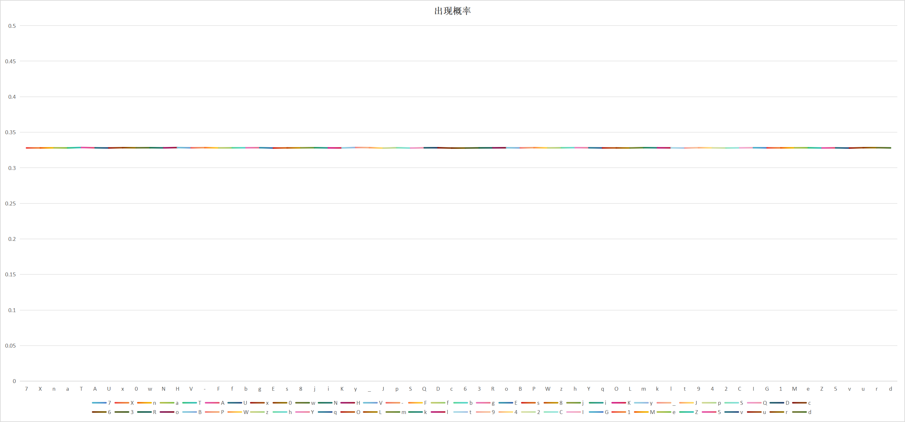

# <center> kgo 快速的Go开发工具简易工具集

<div style="text-align: center;">

  
  
  
  
  
  
  [](https://goproxy.cn)

</div>


想来想去，取了这么一个简单易用的名字，把一些常见的功能放上去，免得在各个项目中分别写一遍，同时开源出来，希望给同是从事Golang开发的朋友们有一丢丢小小的帮助。

> 本工具集仅依赖Go SDK，暂时不考虑依赖其他第三方。

# 1. 前置条件
因为本代码库使用到了泛型，所以需要在Go 1.18以上版本中运行

# 2. 功能目录
- [x] 目录文件相关操作
  - GetExeDir 获得可执行程序所在目录。
  - GetWorkDir 获得工作目录。
  - IsExists 文件是否存在。
  - MustRead 读取一个文件内容到[]byte中，确定文件很小时，直接使用这个方法，很省事。
- [x] 数字相关操作
  - NumJoinStr 将一个数字（int、float）数组合并成一个字符串数组。
  - Nums2Strings 将一个数字（int、float）数组合转换一个字符串数组。
- [x] 字符串相关操作
  - Clean 清理字符串，将其中的特殊字符（括号、标点符号、转义字符等等）一律转换成下划线。
  - JoinElements 将任意基本类型的数组使用英文逗号拼接成一个字符串。
  - B2S byte切片转为string，不使用常规的强转方法，直接引用内存地址转换，性能非常高。
  - S2B string转为byte切片，不使用常规的强转方法，直接引用内存地址转换，性能非常高。
  - MaskChineseName 中文姓名脱敏。
  - MaskChineseNameEx 中文姓名脱敏扩展方法，可指定脱敏位。
  - MaskChineseMobile 中国手机号脱敏。
  - MaskChineseIdCard 中国身份证号脱敏。
  - MaskChineseIdCard34 中国身份证号脱敏，MaskChineseMobile简化版，保留前3位后4位，更易用调用的函数。
  - MaskChineseIdCard64 中国身份证号脱敏，MaskChineseMobile简化版，保留前6位后4位，更易用调用的函数。
  - MaskChineseIdCard11 中国身份证号脱敏，MaskChineseMobile简化版，保留前1位后1位，更易用调用的函数。
  - MaskAnyString 任意字符串脱敏，可指定左侧保留几个字符、右侧保留几个字符。
  - Masker 更强大的字符串脱敏综合工具💊，有多个选项可以用于实现您的脱敏需求，能够将任意敏感信息（身份证号、手机号、地址、银行卡号等等）脱敏，位于子包`kg_str`中。
  - ReverseString 反转字符串。
  - EnglishWordsCount 统计英文单词的数量，对于英文单词的切分，业内有很多讨论，此函数的实现结果仅供参考，本人不参与这些争论。
  - ArabicToChinese 将一个阿拉伯数字转为中文数字，虽然目前仅支持正整数，但是已满足绝大多数业务场景了，实测很好用。
  - IsBlank 判断字符串是否为空白，或者由空白字符（空格、跳格、回车、换行等）组成。
  - IsNotBlank 判断字符串是否不为空，或者不为空白，IsBlank的反逻辑。
  - IsBlankChar 判断字符是否为空白字符。
  - MaxLen 获取字符串列表中的最大长度。
- [x] 本地缓存相关操作
  - Set 设置缓存项，支持仅设置缓存，也支持同时给缓存添加一个过期时间。
  - Get 获得缓存内容。
  - Delete 删除缓存。
  - Exists 判断缓存项是否存在。
  - Size 获得缓存大小。
- [x] Map相关操作
  - HasKey 是否拥有某个Key。
  - MapKeys 将一个Map的所有Key转换成数组返回。
- [x] 数据结构：Set（拥有的元素不可重复，类似于Java中的HashSet），添加的元素必须是可比较的，即实现了标准接口中的comparable，这也可以理解，如果元素不可比较，怎么知道是否重复是否已经存在了呢？
  - Add 添加元素。
  - Remove 删除元素。
  - Clear 清空所有元素。
  - Contains 是否在已经存在的元素中。
  - Len 获得Set集合中元素的数量。
  - Empty 判断Set元素是否是空的。
- [x] 数据结构：Stack（栈），先进后出，后进先出。
  - Push 入栈。
  - Pop 出栈。
  - Peek 查看栈顶元素。
  - Size 获得栈中元素的数量。
- [x] Slice切片相关
  - SlicePagination 切片分页，返回一个分好页的二维数组，可指定页大小。 
  - Contains 包含某个元素。
  - ContainsAll 包含指定元素。
  - ContainsAny 包含任意元素。
  - SameElements 两个切片是否拥有相同的元素，不考虑顺序，元素相同即可。
  - Intersection 两个切片的交集。
  - Union 两个切片的合集，如果遇到重复元素，只保留1个。
  - Diff 两个切片的差集，以第一个参数为基准。
  - SplitCounter 根据给定总数和页大小，生成一个二维切片。许多时候我们需要这样快速完成分页，直接往其中填写内容，这就非常方便。
- [x] 结构体相关操作
  - JoinStructsField 将任意结构体切片中的指定字段的值使用英文逗号拼接成一个字符串，例如：用户列表中，所有用户ID拼成一个字符串。
  - PickStructsField 将任意结构体切片中的指定字段的值提取出来形成一个保持原类型的数组，例如：用户列表中，所有用户ID提取成一个用户ID数组。
  - SliceGroupBy 将任何结构体切片切片中按指定字段的值提取出来进行分组，形成一个Map，例如对用户按类型分组，类型的值为Map的key，对应类型的所有用户集合为Map的Value。
  - CopyFields 复制结构体实例字段值到目标结构体实例，类似于Java中的BeanUtils.copyProperties(src, dst)工具类，这个非常实用，我再也不用写几十行的两个结构体实例赋值的代码了。
- [x] 雪花算法
  - 通用实现方法，在程序启动的时候调用`InitSnowflake(workerId int64, dataCenterId int64) (err error)`初始化一次，到处随时使用方法`SnowflakeId() int64`和`GetSnowflakeId[T string | int64]() (id T)`获得ID，并发安全
- [x] NanoID 更流行的、更短更好用的ID
  - NanoId 生成一个默认大小的NanoID，如果出现错误，会返回error
  - MustNanoId 生成一个默认大小的NanoID，如果中途出现错误，抛出 panic，但实际上是对内存buffer的读写，不会error，也不会panic，并发安全，推荐👍👍👍。
- [x] UUID 高性能UUID
  - Uuid 通用方法，自带缓冲池，不需要初始化，随时获得ID，并发安全。
  - SimpleUuid 去除横线方法，自带缓冲池，不需要初始化，到处随时获得ID，并发安全，推荐👍👍👍。
- [x] 时间函数
  - NowStr 取得通用的当前时间，不必再格式化了。
  - MonthStartTime 取得本月的开始时间。
  - MonthEndTime 取得本月的结束时间。
  - AnyMonthStartTime 以当前时间为基点，取任意月的开始时间（比如上个月、下个月，用正负数控制，与Go标准库的API用法保持一致），这在一些时间计算的时候很有用。
  - AnyMonthEndTime 以当前时间为基点，取任意月的的结束时间（比如上个月、下个月，用正负数控制，与Go标准库的API用法保持一致），这在一些时间计算的时候很有用。
- [x] 杂项
  - RunFuncName 获得当前代码所在函数名。

🍕🍕🍕更多使用方法请参见测试用例或代码注释，都非常简单易用。

# 3. 引入和安装
非常简单，一个指令搞定：
```shell
go get -u github.com/ccpwcn/kgo
```

# 4. 使用方法

使用方法非常简单，kgo作为包名，后面跟着函数名就可以了，比如`kgo.SimpleUuid()`就能生成一个ID。

具体请查看单元测试，那里就是测试代码，或者直接查看源码，都是非常简单的引用类，后面东西多了，复杂了，我再加上专门的使用说明文档吧。

# 5. 性能相关测试
本文档中对性能测试的表述，都是基于Windows 10系统下做的，无特殊环境设置，使用默认配置测试，符合一般使用场景。

## 5.1 雪花算法性能表现
为了确保在生产环境使用没有问题，我特意写了一个性能测试，好好对雪花算法进行了压力测试。

### 5.1.1 非泛型接口性能
此接口只会返回int64类型的ID。具体使用方法参见`[snowflake_test.go](snowflake_test.go)`中的代码示例。

测试方法：在PowerShell中执行的测试命令：
```shell
go test -v -bench="BenchmarkSnowflake_Concurrent_Id" -run=none -count=10 -benchmem
```
命令输出：
```text
goos: windows
goarch: amd64                                 
pkg: github.com/ccpwcn/kgo                    
cpu: Intel(R) Core(TM) i7-6700HQ CPU @ 2.60GHz
BenchmarkSnowflake_Concurrent_Id              
BenchmarkSnowflake_Concurrent_Id-8             9         203077967 ns/op        21983367 B/op     625820 allocs/op
BenchmarkSnowflake_Concurrent_Id-8            12         277161517 ns/op        31229477 B/op     761023 allocs/op
BenchmarkSnowflake_Concurrent_Id-8             9         204514756 ns/op        21902075 B/op     625815 allocs/op
BenchmarkSnowflake_Concurrent_Id-8            12         268109500 ns/op        30850743 B/op     761026 allocs/op
BenchmarkSnowflake_Concurrent_Id-8            10         220143410 ns/op        22856056 B/op     671238 allocs/op
BenchmarkSnowflake_Concurrent_Id-8             9         227427922 ns/op        21570741 B/op     625823 allocs/op
BenchmarkSnowflake_Concurrent_Id-8            10         245171650 ns/op        22504872 B/op     671258 allocs/op
BenchmarkSnowflake_Concurrent_Id-8            10         232327030 ns/op        22703912 B/op     671208 allocs/op
BenchmarkSnowflake_Concurrent_Id-8             9         223790600 ns/op        21771869 B/op     625841 allocs/op
BenchmarkSnowflake_Concurrent_Id-8            10         239567270 ns/op        23161156 B/op     671290 allocs/op
PASS                                                                                                              
ok      github.com/ccpwcn/kgo   24.803s
```

### 5.1.2 泛型接口性能
泛型接口支持返回int64和string两种类型的ID，你可以在调用函数的时候指定返回类型，具体调用代码参见`[snowflake_generic_test.go](snowflake_generic_test.go)`中的代码示例。

测试方法：在PowerShell中执行的测试命令：
```shell
go test -v -bench="Benchmark_GenericSnowflake_Concurrent_Id" -run=none -count=10 -benchmem
```
命令输出：
```text
cpu: Intel(R) Core(TM) i7-6700HQ CPU @ 2.60GHz
Benchmark_GenericSnowflake_Concurrent_Id
Benchmark_GenericSnowflake_Concurrent_Id-8                    10         224993810 ns/op        24819956 B/op     893709 allocs/op
Benchmark_GenericSnowflake_Concurrent_Id-8                    12         282375483 ns/op        32965658 B/op    1027759 allocs/op
Benchmark_GenericSnowflake_Concurrent_Id-8                    12         283087400 ns/op        33369010 B/op    1027736 allocs/op
Benchmark_GenericSnowflake_Concurrent_Id-8                    12         287084958 ns/op        33401450 B/op    1027784 allocs/op
Benchmark_GenericSnowflake_Concurrent_Id-8                    12         284687817 ns/op        33059180 B/op    1027716 allocs/op
Benchmark_GenericSnowflake_Concurrent_Id-8                    12         287791083 ns/op        32944784 B/op    1027756 allocs/op
Benchmark_GenericSnowflake_Concurrent_Id-8                    10         234368130 ns/op        24079393 B/op     893518 allocs/op
Benchmark_GenericSnowflake_Concurrent_Id-8                    10         229153660 ns/op        24258326 B/op     893513 allocs/op
Benchmark_GenericSnowflake_Concurrent_Id-8                    12         292083508 ns/op        33392757 B/op    1027721 allocs/op
Benchmark_GenericSnowflake_Concurrent_Id-8                    10         230679260 ns/op        24353888 B/op     893491 allocs/op
Benchmark_GenericSnowflake_Concurrent_Id_String
Benchmark_GenericSnowflake_Concurrent_Id_String-8             10         278951190 ns/op        28652905 B/op    1004702 allocs/op
Benchmark_GenericSnowflake_Concurrent_Id_String-8              8         248918450 ns/op        26022041 B/op     847370 allocs/op
Benchmark_GenericSnowflake_Concurrent_Id_String-8             10         275623760 ns/op        28527036 B/op    1004687 allocs/op
Benchmark_GenericSnowflake_Concurrent_Id_String-8             10         280000980 ns/op        28835009 B/op    1004686 allocs/op
Benchmark_GenericSnowflake_Concurrent_Id_String-8             10         279923380 ns/op        29070018 B/op    1004786 allocs/op
Benchmark_GenericSnowflake_Concurrent_Id_String-8             10         294371500 ns/op        28708047 B/op    1004654 allocs/op
Benchmark_GenericSnowflake_Concurrent_Id_String-8             10         276980950 ns/op        28606474 B/op    1004658 allocs/op
Benchmark_GenericSnowflake_Concurrent_Id_String-8             12         354999700 ns/op        39017543 B/op    1161183 allocs/op
Benchmark_GenericSnowflake_Concurrent_Id_String-8             12         356444367 ns/op        38855564 B/op    1161128 allocs/op
Benchmark_GenericSnowflake_Concurrent_Id_String-8             10         281144360 ns/op        28855772 B/op    1004697 allocs/op
PASS
ok      github.com/ccpwcn/kgo   62.156s
```

### 5.1.3 综合性能比较
经过多次冷启动测试和热启动测试，有如下结论：
1. 总体上各接口的综合性能表现很是稳定，不会有明显的波动。
2. 非泛型返回int64类型的ID是最快的。
3. 泛型int64类型ID接口比非泛型接口慢不到5%，可以忽略不计。这也从侧面反应出Golang的泛型设计还是非常优秀的，性能损失非常小。
4. 泛型string类型ID接口比泛型int64接口慢约15%到18%，比非泛型ID接口慢20%。这也可以理解，int64类型的大小是确定的，它在栈上，string类型对于程序来说大小是不确定的，它在堆上，自然就慢了。

综合一张图如下所示：


> 之所以提供string类型ID的方法，还是为了便于一些场合性能要求不那么高，却要以string类型保存ID的地方，就不必非常麻烦的每次都要转换一下或者自己再封装一下了。

## 5.2 UUID性能表现
许多时候，我们在生产环境和外部对接的时候，为了避免让对方获得我们的内部信息，公开给别人的ID都是UUID这种完全没有任何规则的ID作为数据的唯一ID，所以，UUID的性能表现尤为重要。

这里提供了两个UUID方法，一个是`Uuid()`，获得标准化的UUID字符串，一个是`SimpleUuid()`，获得没有连接横线的UUID字符串。
### 5.2.1 常规顺序调用生成ID效率
测试命令：
```shell
go test -v -run ".+Uuid.*"
```
执行输出：
```text
=== RUN   Test_Uuid
    uuid_test.go:15: 10905b46-d928-498f-9d09-e84e6610d91d
    uuid_test.go:15: 0a0d7f97-a3e9-49f9-b8d1-a1b86fbb0012
    uuid_test.go:15: 39f536ce-b28b-46bb-a08f-c27982d98fa4
    uuid_test.go:15: e02af045-1fab-4695-bcc0-0b75547dca9b
--- PASS: Test_Uuid (0.01s)
=== RUN   Test_SimpleUuid
    uuid_test.go:28: f272740c16b54447a1afc8e966da7c31
    uuid_test.go:28: 4ddf818bac1344c2aa556948d7cee602
    uuid_test.go:28: b2525c24ecb14573a4db256ff9a92259
    uuid_test.go:28: 490180ab69c34bd59705f2599db4be5c
--- PASS: Test_SimpleUuid (0.00s)
=== RUN   Test_Uuid_Million
--- PASS: Test_Uuid_Million (1.51s)
=== RUN   Test_SimpleUuid_Million
--- PASS: Test_SimpleUuid_Million (1.28s)
PASS
ok      github.com/ccpwcn/kgo   2.914s
```

### 5.2.2 带连接横线的标准UUID性能
测试命令：
```shell
go test -v -bench="Benchmark_Uuid" -run=none -count=10 -benchmem
```
输出：
```text
goos: windows
goarch: amd64
pkg: github.com/ccpwcn/kgo
cpu: Intel(R) Core(TM) i7-6700HQ CPU @ 2.60GHz
Benchmark_Uuid
Benchmark_Uuid-8               1        53649710100 ns/op       4503094704 B/op     125466463 allocs/op
Benchmark_Uuid-8               1        53137904000 ns/op       4502928264 B/op     125466097 allocs/op
Benchmark_Uuid-8               1        51462101000 ns/op       4502855776 B/op     125465750 allocs/op
Benchmark_Uuid-8               1        49230082600 ns/op       4502889848 B/op     125465909 allocs/op
Benchmark_Uuid-8               1        49568695900 ns/op       4502780376 B/op     125465377 allocs/op
Benchmark_Uuid-8               1        47528831100 ns/op       4502946872 B/op     125466180 allocs/op
Benchmark_Uuid-8               1        47420370900 ns/op       4502916472 B/op     125466037 allocs/op
Benchmark_Uuid-8               1        47389986500 ns/op       4502911608 B/op     125466017 allocs/op
Benchmark_Uuid-8               1        47210674300 ns/op       4502959832 B/op     125466241 allocs/op
Benchmark_Uuid-8               1        47669815000 ns/op       4502735312 B/op     125465170 allocs/op
PASS
ok      github.com/ccpwcn/kgo   496.850s
```

### 5.2.3 没有连接横线的UUID性能
测试命令：
```shell
go test -v -bench="Benchmark_SimpleUuid" -run=none -count=10 -benchmem
```
输出：
```text
goos: windows
goarch: amd64
pkg: github.com/ccpwcn/kgo
cpu: Intel(R) Core(TM) i7-6700HQ CPU @ 2.60GHz
Benchmark_SimpleUuid
Benchmark_SimpleUuid-8         1        47748104300 ns/op       4423092008 B/op            125466495 allocs/op
Benchmark_SimpleUuid-8         1        47578242400 ns/op       4422828112 B/op            125465617 allocs/op
Benchmark_SimpleUuid-8         1        47375467200 ns/op       4422877672 B/op            125465850 allocs/op
Benchmark_SimpleUuid-8         1        47069933600 ns/op       4422932680 B/op            125466100 allocs/op
Benchmark_SimpleUuid-8         1        47388836900 ns/op       4422779520 B/op            125465379 allocs/op
Benchmark_SimpleUuid-8         1        46894812600 ns/op       4422802520 B/op            125465498 allocs/op
Benchmark_SimpleUuid-8         1        47800112400 ns/op       4422945992 B/op            125466183 allocs/op
Benchmark_SimpleUuid-8         1        47501667700 ns/op       4422866648 B/op            125465795 allocs/op
Benchmark_SimpleUuid-8         1        46698348500 ns/op       4422895544 B/op            125465935 allocs/op
Benchmark_SimpleUuid-8         1        47791894000 ns/op       4423020064 B/op            125466537 allocs/op
PASS
ok      github.com/ccpwcn/kgo   474.448s
```

### 5.2.4综合性能比较
经过多次测试，综合性能指标如下：
- 常规测试，生成200万个ID耗时约最多1.5秒，性能是相当强悍了。
- 压力测试，生成500万个标准UUID形式的ID耗时约54秒，高并发每秒可生成约92万个标准ID。
- 压力测试，生成500万个无连接线的最简唯一ID耗时约52秒，高并发每秒可生成96万个无连接线的简单ID。
- 不带连接线的简单ID比标准UUID形式的ID性能强约10%。
- 在性能测试中，加入了`sync.Map`用于保证海量的ID仍然是唯一的，不会重复。在实践中，如果没有这个，生成ID的速度可以更快，如果程序运行在热代码状态，性能还能更进一步，所以我认为它能胜任99.99%的业务场景了。

> 剩下那0.01%的业务场景怎么办？也好办，搞多个后台服务，配置不同的workerId和dataCenterId，搞成分布式环境下引用本库生成雪花算法UUID，或者将引用本包中的UUID生成方法的程序布在不同的机器上，那么它们的硬件特征、硬件时钟不同，随机结果就不会重复。因为根据UUID算法的重复性分析研究结果，假如每秒产生10亿笔UUID，100年后只产生一次重复的机率是50%。如果地球上每个人都各有6亿笔UUID，发生一次重复的机率是50%。所以，担心什么？放心用吧。

🍓🍓🍓请允许自我吹嘘一下：如此强悍生成唯一ID工具包，太牛了，我已在大规模生产环境中用起来了！

## 5.3 NanoID 测试
NanoID现在用的人也越来越多了，我也觉得它非常好用。参照网上许多实现，我又结合AI编程助手，写了一份生成NanoID的代码实现，附带有以下测试用例：
- 常规功能测试，验证功能的可用性
- 压力测试，验证在高并发场景下，生成的ID是否唯一
- 综合性能测试，验证在常规场景下，生成的ID性能如何
- 生成ID的随机安全性，经过1000万ID的测试分析，63个候选字符（代码文件中定义的defaultAlphabet），出现次数均稳定在32.7%到32.8%之间，最多出现次数3285257，最少出现次数3277729，偏差7528，63个候选字符出现次数的标准偏差是1657.57103，符合安全性、随机性要求。

这是随机安全性统计图表：


结论：🍓🍓🍓亲测非常好用，已经在生产环境中大规模投入使用。

### 5.3.1 常规测试
- 生成一个NanoID，函数 `func NanoId() (string, error)` ，如果返回错误消息，可以判断一下。
- 生成一个NanoID，函数 `func MustNanoId() string`，如果出现错误会panic，但其实是使用`rand.Read`往内存buffer中读取数据，不会出错的，推荐调用此函数。

### 5.3.2 压力测试
执行命令：
```shell
go test -v -bench="Benchmark_NanoId" -run=none -count=10 -benchmem -cpuprofile=nanoid_cpuprofile
```
输出：
```text
goos: windows
goarch: amd64
pkg: github.com/ccpwcn/kgo
cpu: Intel(R) Core(TM) i7-6700HQ CPU @ 2.60GHz
Benchmark_NanoId
Benchmark_NanoId-8             1        45529490700 ns/op       4616129488 B/op 130154720 allocs/op
Benchmark_NanoId-8             1        45153548900 ns/op       4615686760 B/op 130153291 allocs/op
Benchmark_NanoId-8             1        47777821100 ns/op       4615553368 B/op 130153658 allocs/op
Benchmark_NanoId-8             1        46910560900 ns/op       4615471608 B/op 130153340 allocs/op
Benchmark_NanoId-8             1        44465740900 ns/op       4615590040 B/op 130153992 allocs/op
Benchmark_NanoId-8             1        44691198000 ns/op       4615439160 B/op 130153315 allocs/op
Benchmark_NanoId-8             1        45224104500 ns/op       4615884520 B/op 130153948 allocs/op
Benchmark_NanoId-8             1        44527536700 ns/op       4615485656 B/op 130153593 allocs/op
Benchmark_NanoId-8             1        45062377100 ns/op       4615403208 B/op 130153168 allocs/op
Benchmark_NanoId-8             1        44639632800 ns/op       4615354408 B/op 130152970 allocs/op
PASS
ok      github.com/ccpwcn/kgo   460.940s
```
结论：
- 每秒钟可以生成大约100万个不重复的NanoID，已经能够满足99%的业务场景了，毫无压力。
- 多次测试，无论是时间开销、还是内存开销，都很均衡，说明非常稳定，这代表在生产环境运行时的高可靠。
- 在性能测试中，加入了`sync.Map`用于保证海量的ID仍然是唯一的，不会重复。在实践中，如果没有这个，生成ID的速度可以更快，后台服务中如果是热代码，还能再快。

顺便执行命令`go tool pprof .\nanoid_cpuprofile`看一下前面的步骤生成的 cpuprofile，未发现性能问题。`runtime.scanobject`耗时较多，是因为并行测试生成了很多ID，导致对象扫描较多，这是正常的，不是性能瓶颈。

# 鸣谢
UUID的实现借鉴学习了 https://github.com/google/uuid